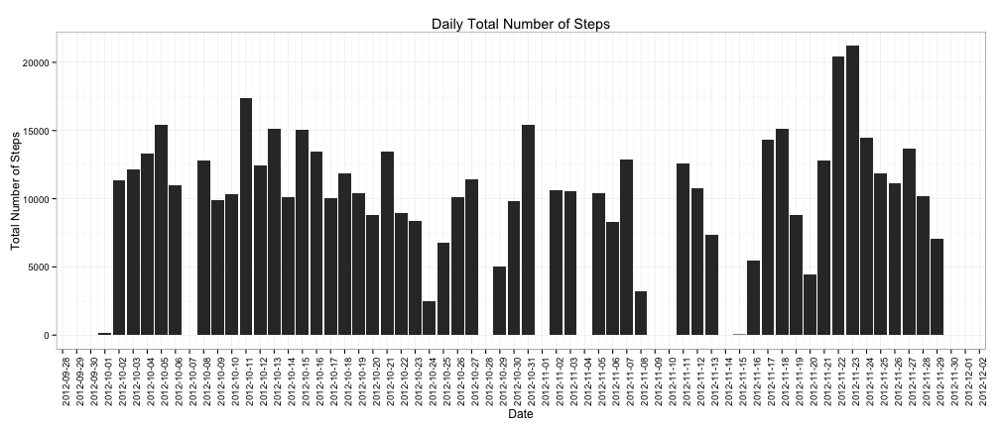

This page created to guide you through the analysis of the personal personal movement activity data as a subject of the reproducible research course assignment. 


```r
# set global chunk options: 
library(knitr)
library(ggplot2)
library(plyr)
library(scales)
opts_chunk$set(cache=TRUE,cache.path = 'PA1_template_cache/', fig.path='figure/')
```

## Loading and preprocessing the data
Importing the data in R.


```r
#Load the data and note the missing values
setwd('~/Desktop/RepData_PeerAssessment1/')
actdata<-read.csv("activity.csv",header=TRUE,sep=",")
```

View of the data as a first step

```r
summary(actdata)
```

```
##      steps               date          interval   
##  Min.   :  0.0   2012-10-01:  288   Min.   :   0  
##  1st Qu.:  0.0   2012-10-02:  288   1st Qu.: 589  
##  Median :  0.0   2012-10-03:  288   Median :1178  
##  Mean   : 37.4   2012-10-04:  288   Mean   :1178  
##  3rd Qu.: 12.0   2012-10-05:  288   3rd Qu.:1766  
##  Max.   :806.0   2012-10-06:  288   Max.   :2355  
##  NA's   :2304    (Other)   :15840
```


Change data format for easier analysis

```r
# Format the date with POSIXct 
actdata$date_new <- as.POSIXct( strptime(as.character(actdata$date), "%Y-%m-%d"))  

# Add column giving the week of the day
actdata$date_of_week<-as.factor(weekdays(as.Date(actdata$date_new)))

# Create a factor variable with Weekday and Weekend
actdata$date_type[actdata$date_of_week %in% c('Saturday','Sunday')]<-"Weekend"
actdata$date_type[!(actdata$date_of_week %in% c('Saturday','Sunday'))]<-"Weekday"
actdata$date_type<-as.factor(actdata$date_type)

# Create a subset removing the NA entries from the steps
actdata_non_na<-actdata[!is.na(actdata$steps),]
summary(actdata_non_na)
```

```
##      steps               date          interval   
##  Min.   :  0.0   2012-10-02:  288   Min.   :   0  
##  1st Qu.:  0.0   2012-10-03:  288   1st Qu.: 589  
##  Median :  0.0   2012-10-04:  288   Median :1178  
##  Mean   : 37.4   2012-10-05:  288   Mean   :1178  
##  3rd Qu.: 12.0   2012-10-06:  288   3rd Qu.:1766  
##  Max.   :806.0   2012-10-07:  288   Max.   :2355  
##                  (Other)   :13536                 
##     date_new                      date_of_week    date_type    
##  Min.   :2012-10-02 00:00:00   Friday   :2016   Weekday:11808  
##  1st Qu.:2012-10-16 00:00:00   Monday   :2592   Weekend: 3456  
##  Median :2012-10-29 00:00:00   Saturday :2016                  
##  Mean   :2012-10-30 16:43:01   Sunday   :1440                  
##  3rd Qu.:2012-11-16 00:00:00   Thursday :2304                  
##  Max.   :2012-11-29 00:00:00   Tuesday  :2592                  
##                                Wednesday:2304
```


## What is mean total number of steps taken per day?
To answer this question only the non NAs days used. The missing values been ignored for this part. Also a Time-Series figure been created to visualise the total steps per day.


```r
# Summarise the steps per day using ddply function
daily_steps<- ddply(actdata_non_na, .(date_new), summarise, steps=sum(steps))
```


Activity:

* Mean = 10766 Steps
* Median = 10765 Steps


```r
ggplot(daily_steps,aes(as.Date(date_new),steps))+
        scale_x_date(name="Date", breaks = date_breaks("day"))+
        geom_bar(stat='identity')+
        ggtitle("Daily Total Number of Steps")+
        ylab("Total Number of Steps")+
        theme_bw()+
        theme(axis.text.x = element_text(angle = 90, hjust = 1))
```

 


## What is the average daily activity pattern?

To understand the average daily activity pattern the following 5 minutes time series chart will depict the average steps taken accross all the days for the same interval.


```r
day_interval<- ddply(actdata_non_na, .(interval), summarise, steps=mean(steps))
ggplot(day_interval,aes(interval,steps))+
        geom_line()+
        ggtitle("Daily Activity Pattern")+
        xlab("5-minute interval")+
        ylab("The average number of steps")+
        theme_bw()
```

 

At the 835 interval is the average maximum steps accross all the active days.


## Imputing missing values

As a first step we need to calculate the total number of missing values in the activity dataset

```r
sum(is.na(actdata$steps))
```

```
## [1] 2304
```

Impute the missing values with the median of the specific time interval. Create a new dataset with the same size as the original and with imputed values instead of NAs.


```r
# Create a median subset for every interval
interval_median<- ddply(actdata_non_na, .(interval), summarise, steps=median(steps))

colnames(interval_median)[2] <- "median_steps"

# Join and sort the original dataset with the interval median dataset
impute_data <- arrange(join(actdata, interval_median), interval)
```

```
## Joining by: interval
```

```r
# Where there is an NA put the median value of that interval
impute_data$steps[is.na(impute_data$steps)] <- impute_data$median_steps[is.na(impute_data$steps)]

summary(impute_data)
```

```
##      steps             date          interval   
##  Min.   :  0   2012-10-01:  288   Min.   :   0  
##  1st Qu.:  0   2012-10-02:  288   1st Qu.: 589  
##  Median :  0   2012-10-03:  288   Median :1178  
##  Mean   : 33   2012-10-04:  288   Mean   :1178  
##  3rd Qu.:  8   2012-10-05:  288   3rd Qu.:1766  
##  Max.   :806   2012-10-06:  288   Max.   :2355  
##                (Other)   :15840                 
##     date_new                      date_of_week    date_type    
##  Min.   :2012-10-01 00:00:00   Friday   :2592   Weekday:12960  
##  1st Qu.:2012-10-16 00:00:00   Monday   :2592   Weekend: 4608  
##  Median :2012-10-31 00:00:00   Saturday :2304                  
##  Mean   :2012-10-30 23:32:27   Sunday   :2304                  
##  3rd Qu.:2012-11-15 00:00:00   Thursday :2592                  
##  Max.   :2012-11-30 00:00:00   Tuesday  :2592                  
##                                Wednesday:2592                  
##   median_steps  
##  Min.   : 0.00  
##  1st Qu.: 0.00  
##  Median : 0.00  
##  Mean   : 3.96  
##  3rd Qu.: 0.00  
##  Max.   :60.00  
## 
```

Make a graph of the total number of steps taken each day and calculate and report the mean and median total number of steps taken per day.


```r
impute_day_steps<- ddply(impute_data, .(date_new), summarise, steps=sum(steps))
ggplot(impute_day_steps,aes(as.Date(date_new),steps))+
        scale_x_date(name="Date", breaks = date_breaks("day"))+
        geom_bar(stat='identity')+
        ggtitle("The total number of steps taken each day")+
        xlab("Sum of steps per day")+
        theme_bw()+
        theme(axis.text.x = element_text(angle = 90, hjust = 1))
```

 

The mean and median are after the imputing:

```r
mean(impute_day_steps$steps)
```

```
## [1] 9504
```

```r
median(impute_day_steps$steps)
```

```
## [1] 10395
```


## Are there differences in activity patterns between weekdays and weekends?

In this section we will use the imputed data have been created in the previous step. In the following graph it is observed that there is a difference between the weekdays and weekend in the wolking activity.


```r
# Summarise average steps across weekdays and weekends
day_type_imputed<- ddply(impute_data, .(interval, date_type), summarise, steps=mean(steps))
ggplot(day_type_imputed,aes(interval,steps))+
        geom_line()+
        facet_wrap(~date_type,nrow=2)+
        ggtitle("Daily Activity Pattern for weekends and weekdays seperately")+
        xlab("5-minute interval")+
        ylab("The average number of steps")+
        theme_bw()
```

 
